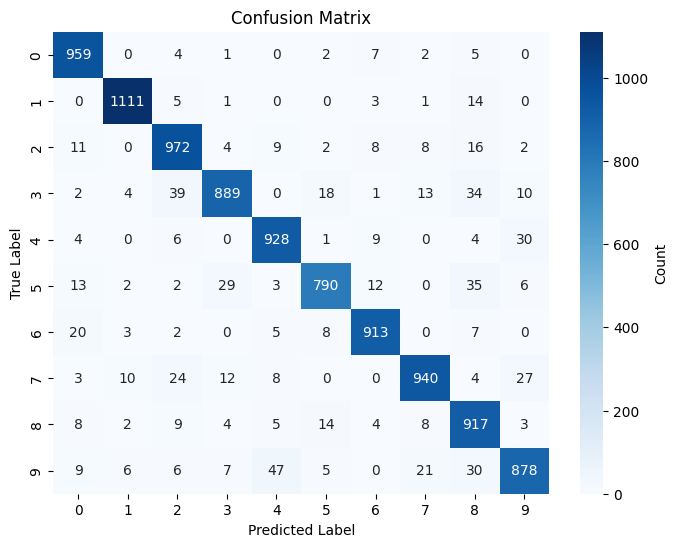

::: {#cell-0 .cell}
``` {.python .cell-code}
# Run this block and make sure it is successful.
import numpy as np  # used for handling mathematical operations easier in python
import tensorflow as tf  # used for creating and training machine learning models 
from tensorflow import keras # Keras contains the mnist dataset
from matplotlib import pyplot as plt  # library that helps us visualize data by creating plots 
import seaborn as sn # visualization library for creating more complex graphs
```
:::


<!-- WARNING: THIS FILE WAS AUTOGENERATED! DO NOT EDIT! -->

::: {#cell-2 .cell}
``` {.python .cell-code}
#TODO: Add the split data line here
```
:::


::: {#cell-3 .cell}
``` {.python .cell-code}
def plotImage(index,x_train,x_test,y_train):
    # Normalize the values so they are a decimal between 0 and 1
    x_train = x_train/255
    x_test = x_test/255
    print(f'The plot represents the number {y_train[index]}')
    plt.imshow(x_train[index],cmap = plt.cm.binary )
    plt.show()


#TODO: change the index to see other values in the dataset
```

::: {.cell-output .cell-output-stdout}
```
The plot represents the number 0
```
:::

::: {.cell-output .cell-output-display}
{}
:::
:::


::: {#cell-4 .cell}
``` {.python .cell-code}
# TODO: Add reshape the data in this code block

# x_train_flat = 
# x_test_flat =
```
:::


::: {#cell-5 .cell}
``` {.python .cell-code}
# Model creation
model = keras.Sequential([
    keras.layers.Dense(128, input_shape = (784,),activation='relu'), 
    keras.layers.Dense(64, activation='sigmoid'), 
    keras.layers.Dense(32, activation='sigmoid'), 
    keras.layers.Dense(10, activation='sigmoid')
])
model.compile (
    optimizer='adam',
    loss = 'sparse_categorical_crossentropy',
    metrics = ['accuracy']
)
```

::: {.cell-output .cell-output-stderr}
```
/Users/lakebradford/Desktop/Machine-learning-demo/.venv/lib/python3.12/site-packages/keras/src/layers/core/dense.py:87: UserWarning: Do not pass an `input_shape`/`input_dim` argument to a layer. When using Sequential models, prefer using an `Input(shape)` object as the first layer in the model instead.
  super().__init__(activity_regularizer=activity_regularizer, **kwargs)
```
:::
:::


::: {#cell-6 .cell}
``` {.python .cell-code}
# TODO: Train the model using model.fit here
```

::: {.cell-output .cell-output-stdout}
```
Epoch 1/5
1875/1875 ━━━━━━━━━━━━━━━━━━━━ 2s 1ms/step - accuracy: 0.7168 - loss: 1.1381
Epoch 2/5
1875/1875 ━━━━━━━━━━━━━━━━━━━━ 2s 937us/step - accuracy: 0.9095 - loss: 0.3223
Epoch 3/5
1875/1875 ━━━━━━━━━━━━━━━━━━━━ 2s 978us/step - accuracy: 0.9140 - loss: 0.2888
Epoch 4/5
1875/1875 ━━━━━━━━━━━━━━━━━━━━ 2s 970us/step - accuracy: 0.9202 - loss: 0.2684
Epoch 5/5
1875/1875 ━━━━━━━━━━━━━━━━━━━━ 2s 1ms/step - accuracy: 0.9198 - loss: 0.2697
```
:::

::: {.cell-output .cell-output-display}
```
<keras.src.callbacks.history.History>
```
:::
:::


::: {#cell-7 .cell}
``` {.python .cell-code}
# TODO: Test the model against the test data using model.evaluate
```

::: {.cell-output .cell-output-stdout}
```
313/313 ━━━━━━━━━━━━━━━━━━━━ 0s 416us/step - accuracy: 0.9094 - loss: 0.3053
```
:::

::: {.cell-output .cell-output-display}
```
[0.26149341464042664, 0.9218999743461609]
```
:::
:::


::: {#cell-8 .cell}
``` {.python .cell-code}
# TODO: Run the confusion matrix
def plot_confusion_matrix(model, x_test_flat, y_test):
    # Make predictions
    y_pred = model.predict(x_test_flat)
    y_pred_labels = [np.argmax(i) for i in y_pred]
    # Create confusion matrix
    confusion_matrix = tf.math.confusion_matrix(labels=y_test, predictions=y_pred_labels)
    # Plot the confusion matrix
    plt.figure(figsize=(8, 6))
    sn.heatmap(confusion_matrix, annot=True, fmt='d', cmap='Blues', cbar_kws={'label': 'Count'})
    plt.title('Confusion Matrix')
    plt.xlabel('Predicted Label')
    plt.ylabel('True Label')
    plt.show()

# TODO: Uncomment out the line below and run the code block
# plot_confusion_matrix(model,x_test_flat,y_test)
```

::: {.cell-output .cell-output-stdout}
```
313/313 ━━━━━━━━━━━━━━━━━━━━ 0s 448us/step
```
:::

::: {.cell-output .cell-output-display}
{}
:::
:::


